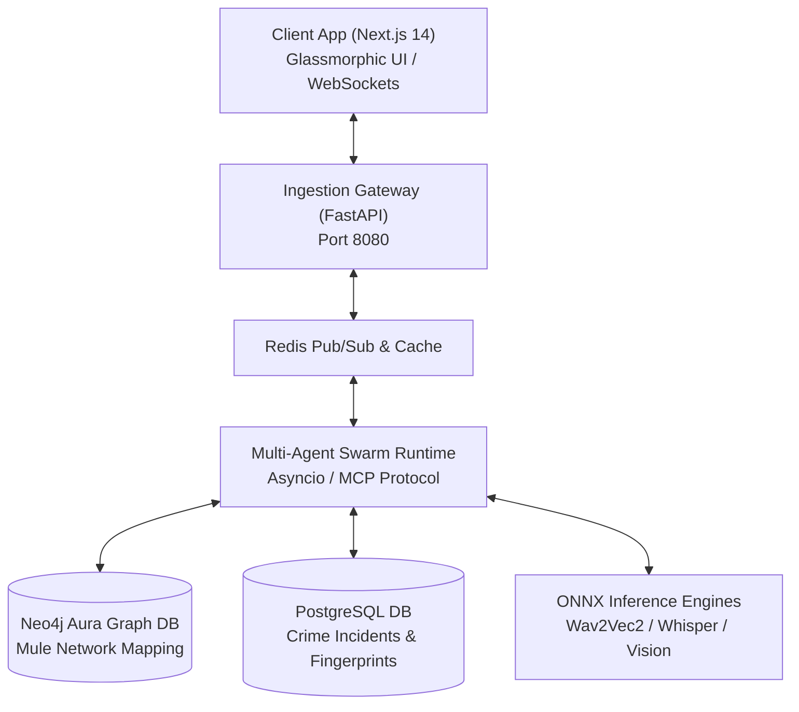

# Kavach-AI: Enterprise Digital Public Safety and Threat Intelligence Infrastructure

> **ET AI Hackathon — Problem Statement 6 (AI for Digital Public Safety)**  
> **Team:** PS6 Dream Developers  
> **Version:** 1.0.0-PROD  

---

## Executive Summary

**Kavach-AI** is an enterprise-grade, autonomous threat intelligence and digital public safety infrastructure designed to combat coordinated cybercrime syndicates, financial fraud, and Fake Indian Currency Notes (FICN). 

The flagship capability of Kavach-AI is **Pre-Emptive Interdiction of "Digital Arrest" Scams** within a strict **7.2-second decision budget**—detecting deepfake video streams, synthetic voice coercion, and imposter law enforcement credentials before financial transfers can occur.

---

## Key Capabilities

- 🛡️ **Pre-Emptive Scam Interdiction**: Real-time multi-modal analysis of video, audio, and sensor telemetry during active calls to detect virtual arrest scams.
- 🤖 **9-Agent Autonomous Swarm**: Parallel agent pipeline powered by Model Context Protocol (MCP) for multi-wave threat assessment and forensic synthesis.
- 💵 **FICN Forensic Verification**: High-precision forensic verification for Fake Indian Currency Notes bypassing conventional counting machines.
- 📊 **Real-Time Glassmorphic Operations Dashboard**: Next.js 14 dashboard with live WebSocket telemetry, GIS threat maps, money flow graph visualization, and forensic dockets.
- 🔐 **Cryptographic Evidence Docketing**: Legal-grade BSA evidence signing using ECDSA (P-256) for courtroom-admissible digital dockets.

---

## System Architecture



### Component Breakdown

| Directory | Stack | Description |
| :--- | :--- | :--- |
| **`Client/`** | Next.js 14, React 18, Tailwind CSS, TypeScript, WebSockets | Real-time threat operations center dashboard, citizen emergency portal, investigator workbench, and teller verification suite. |
| **`kavach_gateway/`** | Python 3.11+, FastAPI, Uvicorn, Async WebSockets, Pydantic v2 | High-throughput REST API ingestion gateway and bi-directional WebSocket streaming manager for audio/sensor streams. |
| **`kavach_agents/`** | Python 3.11+, Asyncio, MCP Protocol, Neo4j, PostgreSQL, ONNX Runtime | Multi-agent swarm daemon executing parallel wave orchestration, graph query mapping, and evidence synthesis. |
| **`tests/`** | Pytest, Asyncio Test Suite | Automated integration test suite validating end-to-end multi-agent swarm interdiction pipeline. |

---

## ⚡ Multi-Agent Swarm Pipeline (7.2s Budget)

The agent swarm operates across 5 parallel waves under a hard deadline of **7,200ms**:

```
[Audio / Video / Telemetry Input]
       │
       ├── Wave 1 (0.0s - 2.4s): Phoneme (Voice) + Hermes (NLP) + Veritas (Credentials) + Aegis (Risk)
       ├── Wave 2 (2.4s - 3.8s): Nexus (Neo4j Mule Account Graph Analysis)
       ├── Wave 3+4 (3.8s - 5.2s): Vanguard (Deepfake/Biometrics) + Lumen (Behavioral Sensor)
       ├── Wave 5 (5.2s - 5.9s): Lex (BSA Cryptographic Docket Signing)
       └── Fuser (5.9s - 6.5s): Decision Synthesis & Interdiction Trigger (Threshold: >= 0.75)
```

| Wave | Agent | Function |
| :--- | :--- | :--- |
| **Wave 1** | `Phoneme` | Audio pitch/jitter stress detection & synthetic voice fingerprinting |
| **Wave 1** | `Hermes` | Natural Language Processing for coercion keywords ("CBI", "Digital Arrest", "Transfer") |
| **Wave 1** | `Veritas` | Imposter badge and official law enforcement seal authentication |
| **Wave 1** | `Aegis` | Initial threat risk calculation and baseline threat index scoring |
| **Wave 2** | `Nexus` | Neo4j graph queries tracing suspect mule accounts and transaction hops |
| **Wave 3+4** | `Vanguard` | Video facial liveness, deepfake artifact inspection, and spatial coherence |
| **Wave 3+4** | `Lumen` | Device gyroscope, accelerometer, and stress sensor telemetry processing |
| **Wave 5** | `Lex` | Legal evidence packaging & cryptographic signing (P-256 ECDSA) |
| **Synthesis** | `Fuser` | Fuses multi-agent confidence vectors into unified interdiction signal |

---

## Repository Directory Structure

```
ET-Kavach-AI/
├── Client/                                     # Next.js 14 Frontend Application
│   ├── app/                                    # App router pages (citizen, investigator, teller, portal)
│   ├── components/                             # Dashboard widgets, GIS map, MoneyFlow graph, UI library
│   ├── context/                                # Auth and Session React Context providers
│   ├── hooks/                                  # Telemetry, WebSocket, and stream hooks
│   └── lib/                                    # API client, WebSocket manager, types, constants
├── kavach_gateway/                             # FastAPI Ingestion Gateway
│   ├── main.py                                 # Gateway entry point
│   ├── config.py                               # Gateway settings and env parser
│   ├── models/                                 # Pydantic data schemas
│   ├── routes/                                 # REST API endpoint routes
│   └── ws/                                     # Audio and sensor WebSocket streaming handlers
├── kavach_agents/                              # Python Multi-Agent Swarm Runtime
│   ├── main.py                                 # Swarm daemon entry point
│   ├── config.py                               # Swarm configuration manager
│   ├── mcp_protocol.py                         # Model Context Protocol integration
│   ├── agents/                                 # 9 specialized agent implementations
│   ├── coordinator/                            # Multi-agent wave orchestrator and fuser
│   └── inference/                              # ONNX model inference engines
├── tests/                                      # Automated integration test suite
│   └── test_swarm_pipeline.py                  # Swarm pipeline interdiction tests
├── README.md                                   # Global repository documentation
├── README_PYTHON.md                            # Python stack execution guide
├── requirements.txt                            # Python dependencies
├── run_gateway.ps1                             # Gateway launch script
├── run_agents.ps1                              # Agent swarm launch script
└── test.http                                   # HTTP endpoint test payloads
```

---

## Getting Started

### System Requirements
- **Python**: 3.11 or higher
- **Node.js**: v18.0.0 or higher
- **Package Manager**: `pnpm` (or `npm`)

### 1. Backend Setup & Launch

```powershell
# Clone the repository
git clone https://github.com/SoloLeveling2022/ET-Kavach-AI.git
cd ET-Kavach-AI

# Install Python requirements
python -m pip install -r requirements.txt
```

Run the launcher scripts from the project root directory:

```powershell
# Terminal 1 — Start FastAPI Ingestion Gateway (Port 8080)
.\run_gateway.ps1

# Terminal 2 — Start Multi-Agent Swarm Daemon
.\run_agents.ps1
```

### 2. Frontend Setup & Launch

```bash
# Terminal 3 — Start Next.js Operations Dashboard
cd Client
pnpm install
pnpm dev
```

Navigate to `http://localhost:3000` in your web browser.

---

## 🔌 API & WebSocket Reference

### Ingestion Gateway Endpoints (`http://localhost:8080`)

| Method | Endpoint | Description |
| :--- | :--- | :--- |
| `GET` | `/api/v1/health` | Gateway health check and service readiness status |
| `POST` | `/api/v1/session/init` | Initialize a new monitoring session and receive `session_id` |
| `GET` | `/api/v1/session/{session_id}/threat` | Query current synthesized threat index score and agent confidence |
| `POST` | `/api/v1/session/{session_id}/close` | Terminate session and generate final signed evidence docket |

### WebSocket Telemetry Streams

- **Audio Stream**: `ws://localhost:8080/api/v1/stream/audio?session_id={SESSION_ID}`
- **Sensor Stream**: `ws://localhost:8080/api/v1/stream/sensor?session_id={SESSION_ID}`

---

## 🧪 Automated Testing

Execute the automated integration test suite to verify agent pipeline performance under simulated threat conditions:

```powershell
# Run swarm interdiction tests
python -m pytest tests/test_swarm_pipeline.py -v
```

---

## 📄 Specifications & Documentation

- [Product Requirement Document (PRD), SRS & System Design](<./documents/[Updated Version] Product Requirement Document (PRD), Software Requirements Specification (SRS), and System Design Specification for Kavach-AI.md>)
- [Digital Public Safety & Threat Intelligence Spec](<./documents/[Updated version ]Kavach-AI_ Enterprise Digital Public Safety and Threat Intelligence Infrastructure.md>)
- [Multi-Agent Orchestration Blueprint](./documents/System_Design_and_Multi_Agent_Orchestration_Blueprint.md)
- [Client Frontend Guide](./Client/README.md)
- [Client Deployment Guide](./Client/DEPLOYMENT.md)

---

## ⚖️ License & Attribution

Developed for **ET AI Hackathon 2026 — PS-6 (AI for Digital Public Safety)** by **PS6 Dream Developers**.  
Repository Owner: [SoloLeveling2022](https://github.com/SoloLeveling2022) | Contributor: [Sri-Hasnika](https://github.com/Sri-Hasnika)
